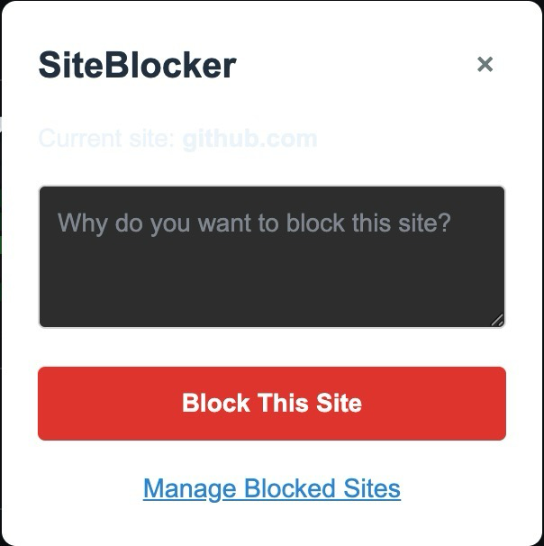

# 🚫 SiteBlock 📟
SiteBlock is a userscript that allows blocking unwanted websites, giving possibility of putting a description why did a user blocked it.

# 🔍 Showcase 👀

# ✅ Download ✅
[Greasy](https://greasyfork.org/en/scripts/540251-siteblocker)
